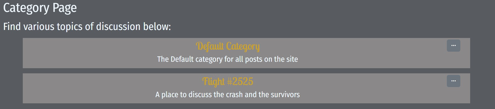

- [Features](#features)
- [Site Development](#site-development)
- [Design](#design-choices)
- [Testing Document](/testing.md)
- [Technology Used](#technology-used)
- [Development](#development)
    - [Cloning](#cloning)
- [Deployment](#deployment)
- [Bug Testing](#bug-testing)
- [Credits](#credits)

## Features

### The Nav Bar
- The nav bar is universal accross all pages, it contains the site logo, which works as a link to the index page, a link to the sign up and log in pages
- 
- The login/Logout link changes text depending on whether the user is logged in

### The Post Form
- The first feature users see on the site is the post form, which is contained at the top of the site
- 
- The post form is styled using bootstrap and each element requires validation from the HTML
- The post form allows them to send posts, select the most relevant categories and tags for their posts and make their posts look unique

### Category List
- On the side of the index page, the site's verious categories are displayed
- This allows users to see which categories are being interacted with and find which topics are most relevant to them
- 
- The links in the box allow users to see the various categories and the category list view

### Post Layout
- All posts on the index page are displayed in chronological order
- This makes them easy to access for users and shows them the most up to date information and discussions
- 
- The post displays the title, username, category, tag and post content
- The post is laid out in a way that make it as easy as possible for users to read, by spacing the information out well and varying the user of headings, subheadings, and text

## Category Detail View

### The category detail view header
- Each page has a header showing the title and description of the category
- This helps users navigate the site, as the header also contains a link to take them back to the category list as a whole
- 
- The header also encourages discussion by eleboarating on the topics of discussion at hand

### The Tag list
- The tag list tis displayed off to the side, and makes it easy for users to see them
- The tags help show the users what the posts are about and give them a clear view on what the post is about
- In future these tags could be used to sort posts
- The colour coding also helps to distinguish posts
- 

### Add Tag form
- The add tag form is accessed from the bottom of the tag list 
- It allows users to create custom tags without using the admin panel 
- They can choose a title and pick a colour which will be used to mke their posts look unique
- 
- The form also contains a cancel button to return users to the last page they visted without submitting the form

### Category List view
- The category list view displays all the categories by order of when they were created
- 

### The Category CRUD functions
- The category edit and delete functions can be retrieved from the category list via a dropdown 
- 
- This allows users to edit and delete categories without accessing the admin panel 
- The dropdown helps keep the tidy clean and allows for resposiveness, as I am not dealing with several elements moving around

### Add Category form
- The add category form is linked at the bottom of the category link form
- This allows for the users to add new category without the admin panel 
- 
- The form also features a cancel button which returns users to their last page without submitting the form

### Edit Category Form
- This form serves the edit post functionality, and allows the users to edit their categories without using the admin panel
- The form is served over the same template, only using the category information as a initial state of the form 
- 
- Reusing templates allows for the site to maintain cohesion and also usibility 

## Login page

### The sign in page 
- The sign in page allows users to sign in and interact with the page
- Once the users log in, they are redirected to the index page
- At the bottom, there is an admin login link, which allows admins to reach the login page 
- 

### The signout page
- The logout page is accessed from the navbar
- Once a user logs out, they are redirected to the index page
- 
- It asks the user for confirmation before they logout so they cannot accidentally logout

### The create account page
- The create account page has a link to sign in for users that already have an account
- The login form is laid out for the users in a simple and easy to read way
- 

## Post Detail

### The Posts
- The posts in the post detail view are laid out the same as accross the site, allowinf for quicker comprehension and site cohesion

### Comments
- From the post detail view, users are able to make comments and interact with other users
- The comment form only displays if a user is logged in to try and reduce errors being returned by anonymous user objects
- 
- The user's username is also displayed to allow them to see who they're interacting as

### Comment Delete
- Comments can also be deleted by the user who made them or a member of staff
- This helps if users want to edit for spelling or is a user has left a comment that violates site rules
- 

### Post CRUD
- From anywhere the post is accessed, the user who made the post or a member of staff can edit or delete the post using a drop down link
- 
- This allows for more control from admins and for users to fix mistakes in their posts

### Post Edit form 
- While the delete function on a post is done in the dropdown, the edit function takes the user to an edit form so they can manipulate the post 
- 
- The post form does not submit if the data is not valid and the form also contains a cancel button to allow users to leave the page without submitting any data

## Site Development

This site was developed using the Django framework, to help wih development, I created a sitemap so that I could decide which features to implement on which page. This was important for developing templates, so I knew which pages to implement when

To better understand the mechanics of the database, I built a database schema to show the relations of the various tables and fields.

## Design Choices

The website was designed to be a bridge between retro true crime and conspiracy forums and modern micro forums like reddit. The conspiracy forums of the early internet were a gathering place for people with fringe ideas. They were often developed by people in their spare time and didn’t necessarily have dedicated development UX/UI staff. The websites were hard to navigate but were a clear passion project for those involved. More modern sites like Reddit have sprung up as a response to web 2.0 and have been developed with users in mind. They provide a more user friendly and aesthetically appealing website, at the cost of the authenticity that the underground, less polished sites provided. 

As this project is intended as an in-universe tie-in to the show yellowjackets, fonts and colours were picked from the show, to keep with the show. The show uses a dark colour palette to represent both the cult and conspiracy storylines within the show, and these were used across the site to help it feel more underground like the earlier sites. 

Fonts were chosen mainly because of their spacing and simplicity to help with accessibility. Fira Sans Condensed is a sans-serif font which is well spaced and modern, but still looks similar to the typewriter fonts, which again speaks to the conspiracy at the heart of the show.

While the font 'Lobster Two' was chosen to add a design flair to the site and to match the promotional material of the show. 

## Technology Used

* Django - The main framework used to create responsive web pages
* Jinja 2 - The scripting language used to combine the HTML and Django elements
* Python - Used to develop the backend of django and communicate with the database
* ElephantSQL - Used to host the main database of the site
* JavaScript - Used to add reactive elements to the front-end of the website, mainly using the Jquery framework
* Bootstrap - A CSS/HTML framework used to help with shorthand styling on across the site
* HTML - Used to create the basic skeletons of the site
* CSS - Used for styling across the site
* Cloudinary - Hosting Static files

## Bug Testing

### Fixed errors

- Early during development, I accidentally commited and pushed the secret key to github. This is a major security issue and would compromise the safety of the website. To fix this, I changed the secret key and then switched it from the settings.py file, which is commited and hosted on github, to the env.py file, which is stored on my machine

- [Solved bug 1](https://github.com/alcl2000/pp4-Amy-Lewis/issues/35) The Category id was initially used to create URLS for the category detail page. This was insufficient data and led to errors in generating the URL
    - To remedy this, the autoslugfield was added to populate the slug for the Category Detail from the title 
    - 
- [Solved bug 2](https://github.com/alcl2000/pp4-Amy-Lewis/issues/41) The Tag model was originally linked directly to specific categories, to try and make tags specific to categories
    - This was casuing errors in feeding in the category to the add tag form, and as a result the feature was scrapped
    - Even though this reduced functionality in the websiite and erased some of the orignal features, the scope of this project is still large enough that it did not necessarily require this added functionality
    - In future, tag forms could be generated on the category list page, to better import the necessary data

### Unsolved errors

- [Unsolved Bug]((https://github.com/alcl2000/pp4-Amy-Lewis/issues/50)) The 'Post Like' icon does not chnage when a user likes a post, this is an issue because it hinders user's feelings of meaningful interactions
    - To try and remedy this, I added a like counter to the posts to show the users their interactions directly
    - This has the added benefit of showing users which posts have the most likes, which they can use as a way of sorting posts in future

## Development

### Creating a repository
- Either create an account or log into GitHub.com
- From your profile click the 'Repositories' section and then click the 'New' button
- Then, give your repository a unique name and open in your IDE of choice

### Forking
- From the repository page, click 'fork' at the top
- The repository will then be in your listed repositories on your profile

### Cloning
- From the top of the repository page, select the drop-down 'Code' and then pick the 'GitHub CLI' section
- Copy the command presented, and run it in the command line of your chosen IDE

## Deployment

### Deployment to Heroku

- To deploy your project to Heroku
    - First go to [Heroku](https://www.heroku.com/) and either login or create an account
    - From your dashboard, click 'Add App'
    - Go to settings, and scroll down to the section labelled 'Config Vars'
    - Here, enter the following key pairs
        - The secret key for your project
        - The database URL
        - The Cloudinary URL
    - Return to the database and link your project to a github repository, you can choose which branch to deploy
    - You can enable automatic deployments at the bottom of the page, or choose to just deploy the main branch as it is currently

### Linking static files to Cloudinary

- Django does not serve static files to deployed sites, as such static files and assets must be deployed on the cloud
- To create Cloudinary storage:
    - Go to [Cloudinary's Website](https://cloudinary.com/) and either create an account or log in
    - From there, create a 'new product environment'
    - In the new environment navigate to the 'Programmable meadia tab', this is where the various seecret keys and URLs necessary to host your files are located
- Once these keys have been obtained, you must now link them to either your django file, if still in development, or into heroku, as detailed above

### Deploying a database to ElephantSQL

- To create my production database, I used ElephantSQL to host it remotely
    - Head to [Elephant's website](https://www.elephantsql.com/) and either create an account or login
    - From the dashboard, create a new instance
    - Select the 'Tiny Turtle' plan
    - Give the database a name, and tag, if necessary
    - Select a region local to you to host the database
    - Confirm the details of your database are correct and select 'create'

## Credits

- [Auto Slug Field](https://django-autoslug.readthedocs.io/en/latest/ ) used to create auto slugs on the site
- [Bootstrap Icons](https://icons.getbootstrap.com/)
