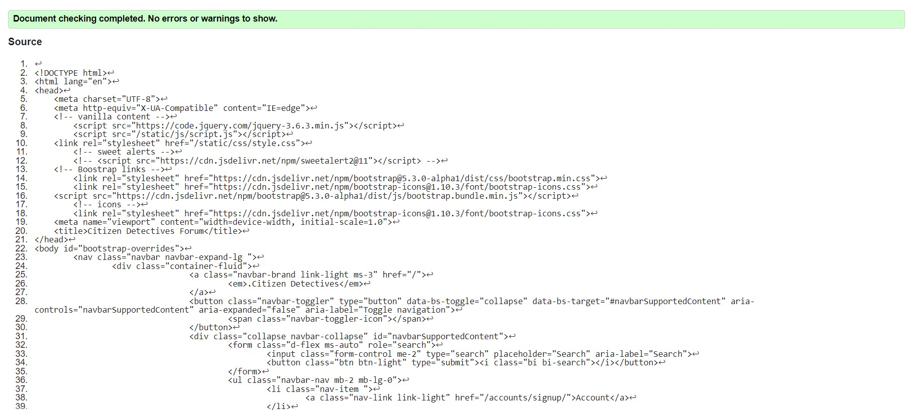
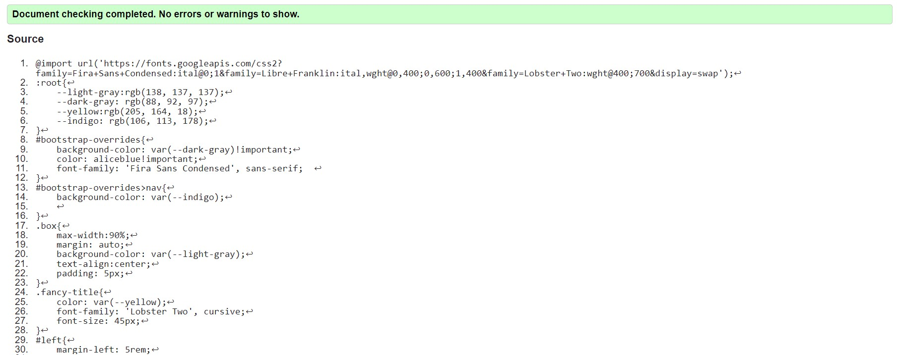
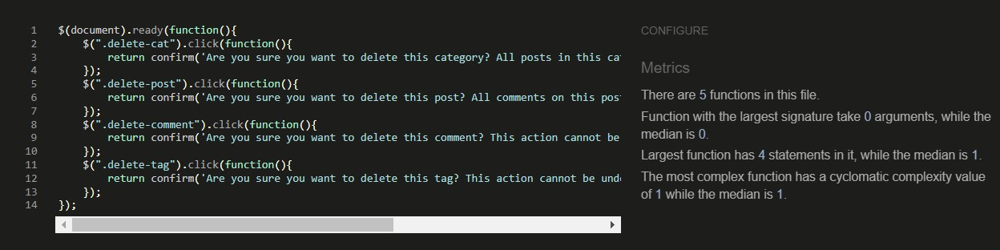

# Testing document

-[Validators](#validators)
-[Manual Testing](#manual-testing)

## Validators

 -  All custom HTML pages on my site pass HTML validation from W3C 
 
 - My one page of CSS Passes validation from WC3 as well 
 
 - The Jquery file has passed validation through JShint
 

 ### Python Validation
 

## Manual Testing