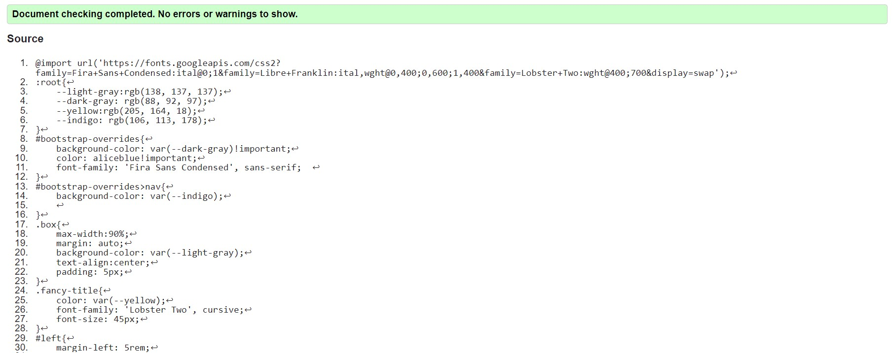
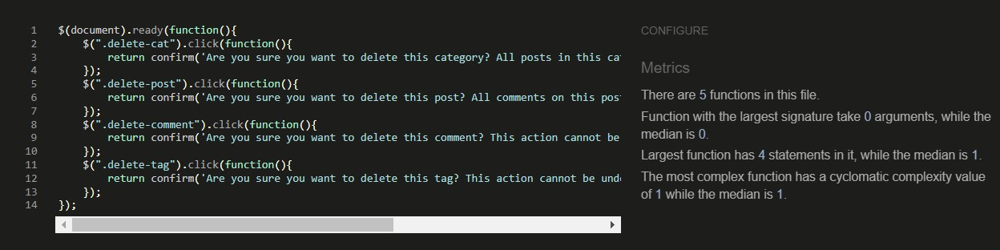
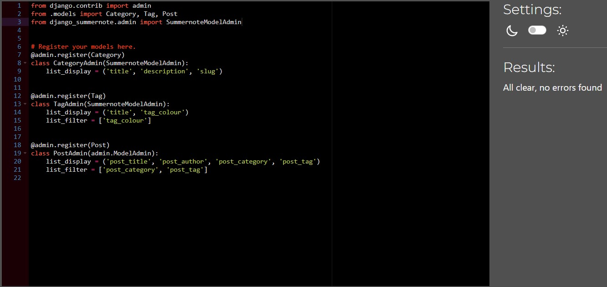
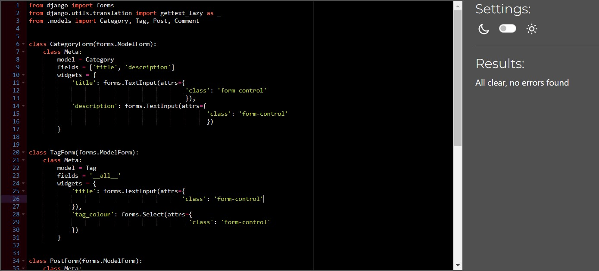
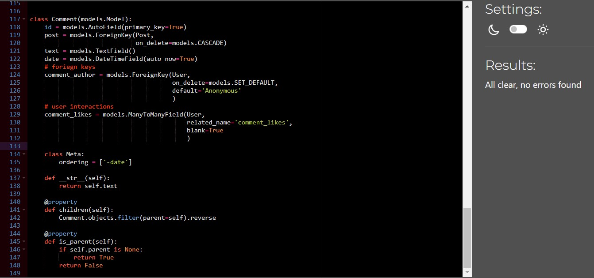
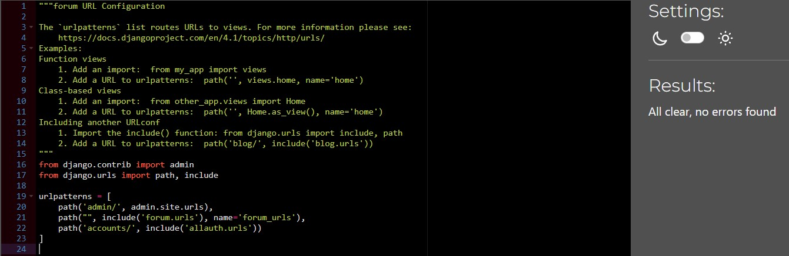
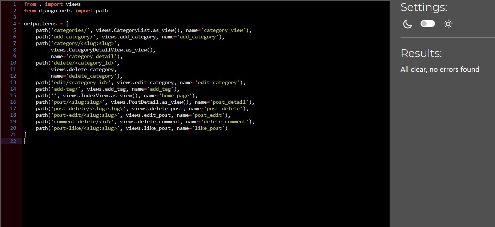
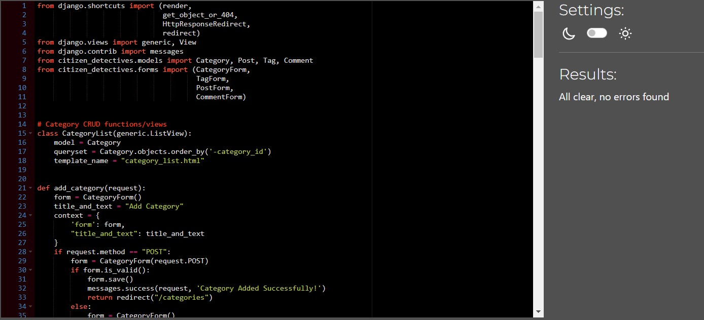

# Testing document

-[Validators](#validators)
-[Manual Testing](#manual-testing)

## Validators

 -  All custom HTML pages on my site pass HTML validation from W3C 
 
 - My one page of CSS Passes validation from WC3 as well 
 
 - The Jquery file has passed validation through JShint
 

 ### Python Validation
- All custom python files in the citizen_detective app pass python validation through CI's own pep8 validator

- All the custom python files in the forum app pass python validation through CI's own pep8 validator

## Manual Testing

### Nav Bar

<table>
  <tr>
   <td>Feature 
   </td>
   <td>Indented action
   </td>
   <td>Actual Action
   </td>
   <td>Outcome
   </td>
  </tr>
  <tr>
   <td>Site logo
   </td>
   <td>When the site logo is clicked, it returns the user to the index page
   </td>
   <td>When clicked, the user is redirected to the index page
   </td>
   <td>Pass
   </td>
  </tr>
  <tr>
   <td>Account Button
   </td>
   <td>When the link is clicked, the user is taken to the sign up page
   </td>
   <td>When the button is clicked, the sign up page is returned
   </td>
   <td>Pass
   </td>
  </tr>
  <tr>
   <td>Login button - user logged out
   </td>
   <td>If a user is logged out the final link on the nav bar directs them to log in 
   </td>
   <td>When a user is not logged in the final link on the nav bar reads ‘log in’ and directs them to the log in page
   </td>
   <td>Pass
   </td>
  </tr>
  <tr>
   <td>Logout button - user logged in
   </td>
   <td>If a user is logged in, the final navbar link directs them to log out 
   </td>
   <td>When a user is not logged in, the final link on the nav bar reads ‘log out’ and directs them to the log out page 
   </td>
   <td>Pass
   </td>
  </tr>
</table>

### Index page 

<table>
  <tr>
   <td>Feature
   </td>
   <td>Intended Action
   </td>
   <td>Actual Action 
   </td>
   <td>Outcome
   </td>
  </tr>
  <tr>
   <td>Post link in title
   </td>
   <td>When the link in the title is clicked it takes you to the post detail view using the post’s slug to view the post detail
   </td>
   <td>Clicking the link takes you to the post detail view 
   </td>
   <td>Pass
   </td>
  </tr>
  <tr>
   <td>Post ‘like button’
   </td>
   <td>If a user is logged in, the form posts and the user’s like is added to the post like count
   </td>
   <td>The like is added when a logged in user clicks the button
   </td>
   <td>Pass
   </td>
  </tr>
  <tr>
   <td>Post ‘like button’
   </td>
   <td>If a user is not logged in, the form does not post and instead a dropdown appears telling them to log in
   </td>
   <td>When a user is not logged in, they are asked to log in before liking a post
   </td>
   <td>Pass
   </td>
  </tr>
  <tr>
   <td>Post ‘comment’ button
   </td>
   <td>If a user clicks the comment button from the index page it takes them to the post detail page and directs them to the comment form
   </td>
   <td>When the comment button is clicked they are redirected to the post’s comment section
   </td>
   <td>Pass
   </td>
  </tr>
  <tr>
   <td>Make Post From
   </td>
   <td>If a user is logged in they can make a post 
   </td>
   <td>When logged in a user can make a post
   </td>
   <td>Pass
   </td>
  </tr>
  <tr>
   <td>Make Post Form
   </td>
   <td>If a user is not logged in they cannot make a post 
   </td>
   <td>When logged out, users cannot make posts
   </td>
   <td>Pass
   </td>
  </tr>
  <tr>
   <td>-
   </td>
   <td>Input validation - Title
   </td>
   <td>A title must be entered to post the form
   </td>
   <td>Pass
   </td>
  </tr>
  <tr>
   <td>-
   </td>
   <td>Input validation - Category
   </td>
   <td>A category must be selected to make the post 
   </td>
   <td>Pass
   </td>
  </tr>
  <tr>
   <td>-
   </td>
   <td>Input validation - Tag
   </td>
   <td>A tag must be selected to make the post
   </td>
   <td>Pass
   </td>
  </tr>
  <tr>
   <td>-
   </td>
   <td>Input Validation - Post
   </td>
   <td>A post must be written for the post to be made
   </td>
   <td>Pass
   </td>
  </tr>
  <tr>
   <td>Category List Link
   </td>
   <td>When a user clicks the link they are able to view the category list view 
   </td>
   <td>When the link is clicked, the user is redirected
   </td>
   <td>Pass
   </td>
  </tr>
  <tr>
   <td>Category Link
   </td>
   <td>If the link is clicked, it should use that categories’ slug to take the user to the category detail view, which shows them the content in a specific category
   </td>
   <td>When the link is clicked, the user is redirected 
   </td>
   <td>Pass
   </td>
  </tr>
  <tr>
   <td>Post drop down - edit function
   </td>
   <td>If a user is a staff member, or the creator of a post, they are able to edit the post 
   </td>
   <td>When the user who created the post or a staff member is logged in, they are able to edit a post 
   </td>
   <td>Pass
   </td>
  </tr>
  <tr>
   <td>Post drop down - delete function
   </td>
   <td>If a user is a staff member or the creator of a post, they are able to delete the post
   </td>
   <td>If a user is logged in as staff or the creator of a post, they are able to delete the post after pressing a JQuery confirmation
   </td>
   <td>Pass
   </td>
  </tr>
</table>

### Post Detail view 

<table>
  <tr>
   <td>Feature
   </td>
   <td>Intended Action
   </td>
   <td>Actual Action
   </td>
   <td>Outcome
   </td>
  </tr>
  <tr>
   <td>‘Post Like’ function
   </td>
   <td>If a user is logged in they are able to interact with the post like form and add their like to a post 
   </td>
   <td>When a logged in user clicks the like button, their like is added to a post
   </td>
   <td>Pass
   </td>
  </tr>
  <tr>
   <td>‘Post Like’ function
   </td>
   <td>If a user is not logged in they cannot use the form 
   </td>
   <td>If a user is not logged in, a dropdown appears to inform them they need to log in to interact with the post 
   </td>
   <td>Pass
   </td>
  </tr>
  <tr>
   <td>Comment form -Logged in 
   </td>
   <td>When user is logged in, they are able to leave a comment on the post 
   </td>
   <td>When logged in, a user may leave a comment
   </td>
   <td>Pass
   </td>
  </tr>
  <tr>
   <td>Comment form - Not logged in 
   </td>
   <td>When logged out, a user cannot access the comment form 
   </td>
   <td>When logged out, a user may not try to leave a comment
   </td>
   <td>Pass
   </td>
  </tr>
  <tr>
   <td>Comment form - validation 
   </td>
   <td>A user cannot make an empty comment
   </td>
   <td>A user may not post a comment without any content
   </td>
   <td>Pass
   </td>
  </tr>
  <tr>
   <td>Comment drop down delete
   </td>
   <td>If a user is logged in as staff or the creator of the comment, they are able to delete the comment
   </td>
   <td>If the user who create the comment or a staff member is logged in, they are able to delete a comment
   </td>
   <td>Pass
   </td>
  </tr>
  <tr>
   <td>Post drop down - edit function
   </td>
   <td>If a user is a staff member, or the creator of a post, they are able to edit the post
   </td>
   <td>When the user who created the post or a staff member is logged in, they are able to edit a post 
   </td>
   <td>Pass
   </td>
  </tr>
  <tr>
   <td>Post drop down - delete function
   </td>
   <td>If a user is a staff member or the creator of a post, they are able to delete the post
   </td>
   <td>If a user is logged in as staff or the creator of a post, they are able to delete the post after pressing a JQuery confirmation
   </td>
   <td>Pass
   </td>
  </tr>
</table>

### Category Detail View

<table>
  <tr>
   <td>Feature
   </td>
   <td>Intended Outcome
   </td>
   <td>Actual Outcome
   </td>
   <td>Outcome
   </td>
  </tr>
  <tr>
   <td>Add Tag button
   </td>
   <td>If a user clicks the add tag button they are taken to the add tag page
   </td>
   <td>When the add tag button is clicked, the user is redirected to the add tag page
   </td>
   <td>Pass
   </td>
  </tr>
  <tr>
   <td>Post detail link
   </td>
   <td>If a user clicks the link in the post title, they are taken to the post detail view
   </td>
   <td>When the title is clicked, the user is taken to the post detail view
   </td>
   <td>Pass
   </td>
  </tr>
  <tr>
   <td>‘Post Like’ function
   </td>
   <td>If a logged out user clicks the post like function, they are asked to log in
   </td>
   <td>When a logged out user clicks the button, they are directed to log in to ‘like’ the post
   </td>
   <td>Pass
   </td>
  </tr>
  <tr>
   <td>‘Post Like’ function
   </td>
   <td>If a user is logged in they can submit the form and either add or remove their like from the post 
   </td>
   <td>When logged in the form submits and and the user and can either add or remove their like from a post 
   </td>
   <td>Pass
   </td>
  </tr>
  <tr>
   <td>‘Post Comment’ button
   </td>
   <td>When a user clicks the post comment button they are taken to the post detail view and the comment section
   </td>
   <td>On click, a user is taken to the post detail view and comment section
   </td>
   <td>Pass
   </td>
  </tr>
  <tr>
   <td>Back to category page link
   </td>
   <td>When a user clicks the link it should take them to the category list page 
   </td>
   <td>When a link is clicked, the user is taken to the category list page
   </td>
   <td>Pass
   </td>
  </tr>
</table>

